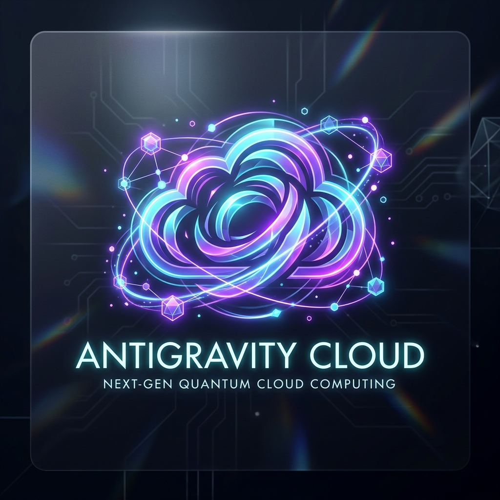
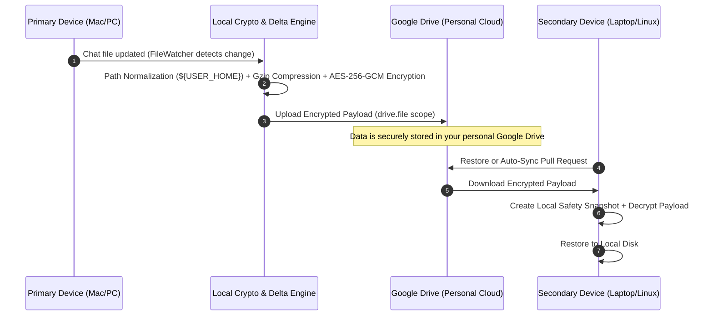
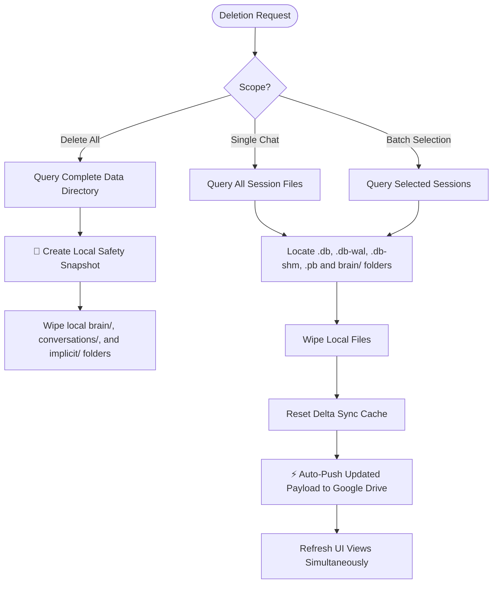
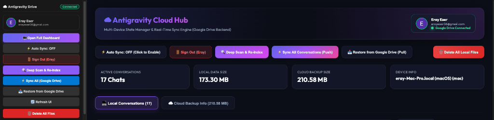

# ☁️ Antigravity Cloud

**Multi-Device State Manager & Zero-Knowledge Sync Engine for Antigravity AI**

*Seamlessly backup, sync, and access your local Antigravity AI conversations, transcripts, and AI artifacts across Mac, Windows, and Linux.*

---

## 📖 Extension Architecture & User Guide

Antigravity Anywhere is designed to seamlessly sync your AI conversation history (`transcripts`), memory databases (`conversations`), AI artifacts (`brain`), and system configurations across all your devices with end-to-end zero-knowledge security.

---

## 📂 1. Data Storage & File Locations

Antigravity AI stores conversation data locally on your computer in the following directories:

| Data Type | macOS Path | Windows Path | Linux Path | Description |
|---|---|---|---|---|
| **Transcripts & Artifacts** | `~/.gemini/antigravity-ide/brain/` | `%USERPROFILE%\.gemini\antigravity-ide\brain\` | `~/.gemini/antigravity-ide/brain/` | JSONL chat transcripts, generated code blocks, and workspace artifacts. |
| **Chat Databases** | `~/.gemini/antigravity-ide/conversations/` | `%USERPROFILE%\.gemini\antigravity-ide\conversations\` | `~/.gemini/antigravity-ide/conversations/` | SQLite database files storing session history (`.db`, `.db-wal`, `.db-shm`). |
| **Implicit Memory (Protobuf)** | `~/.gemini/antigravity-ide/implicit/` | `%USERPROFILE%\.gemini\antigravity-ide\implicit\` | `~/.gemini/antigravity-ide/implicit/` | Context memory index files (`.pb`). |
| **IDE System Cache** | `~/Library/Application Support/Antigravity IDE/` | `%APPDATA%\Antigravity IDE\` | `~/.config/Antigravity IDE/` | State delta sync cache (`delta_sync_state.json`). |

---

## 🔄 2. Data Flow & Synchronization Workflow

Antigravity Anywhere operates on a **Zero-Knowledge Architecture**. Data is encrypted locally before ever leaving your machine and stored in your personal Google Drive storage.

### Sync Lifecycle:
1. **File Watcher:** Real-time background detection when chat transcripts or databases are modified.
2. **Cross-OS Path Normalization:** Replaces OS-specific absolute paths (e.g. `/Users/name/...`) with `${USER_HOME}` to guarantee cross-OS compatibility between macOS, Windows, and Linux.
3. **Compression & Encryption:** Payloads are compressed with Gzip and optionally encrypted with AES-256-GCM authenticated encryption.
4. **Google Drive Cloud Storage:** Uploaded exclusively to your personal Google Drive account under isolated `drive.file` scope.

---

## 🗑️ 3. Deletion Mechanics & Cloud Propagation

Deletion operations perform full 3-layer cleanup to eliminate orphan files and prevent deleted chats from resurfacing across devices:

### Deletion Details:
- **Single Conversation Delete:** Removes `brain/<convId>`, `conversations/<convId>.db`, `.db-wal`, `.db-shm`, and `implicit/<convId>.pb` files from local disk.
- **Cloud Auto-Push:** When a conversation is deleted locally, an immediate background sync (`Cloud Push`) updates your Google Drive payload. Other devices restoring or auto-syncing will automatically see the deletion propagated.
- **Delete All Local Files:** Creates an automatic timestamped **Safety Snapshot** backup before wiping local directories, protecting against accidental data loss.

---

## 🔑 4. Google Drive OAuth 2.0 PKCE Login

Uses an automated **OAuth 2.0 PKCE** flow via local callback server (`127.0.0.1:PORT`):

1. Click **"🔑 Sign in with Google"** in the sidebar or dashboard.
2. Authorize in your browser.
3. Upon approval, Google redirects to your local loopback server.
4. Access tokens and profile info (avatar, display name, email) are automatically saved and refreshed.

---

## 🛠️ 5. Dashboard Features

- **Master Select All Checkbox:** Select/deselect all visible items with indeterminate checkbox state support (`Select All` / `Deselect All` / `X Selected`).
- **Live Search Filter:** Instant filtering by chat title or session ID.
- **User Profile Card:** Displays your active Google user avatar, display name, and email.
- **Sign Out:** One-click session disconnect.

---

## 🛡️ Security & Privacy

- **Client-Side Encryption:** Uses PBKDF2 key derivation and AES-256-GCM authenticated encryption.
- **Minimal Scope:** Operates strictly under `drive.file` scope, giving access only to files created by this extension.

---

## 👨‍💻 Author & Contact

Developed with ❤️ by **Eray Eser**

- 📧 **Email:** [erayeser06@gmail.com](mailto:erayeser06@gmail.com)
- 🐙 **GitHub Profile:** [github.com/sircamsircam](https://github.com/sircamsircam)
- 🚀 **GitHub Repository:** [github.com/sircamsircam/antigravity-cloud](https://github.com/sircamsircam/antigravity-cloud)

---

## 📄 License

Distributed under the MIT License. See `LICENSE.txt` for details.
